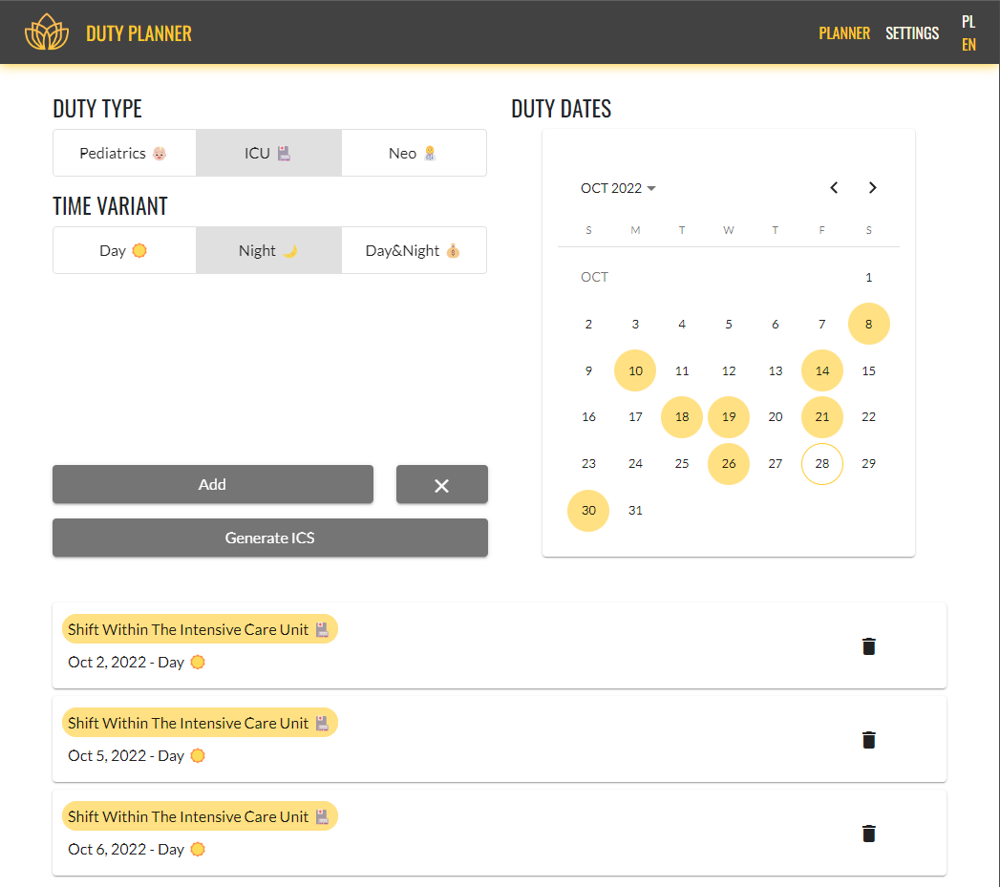
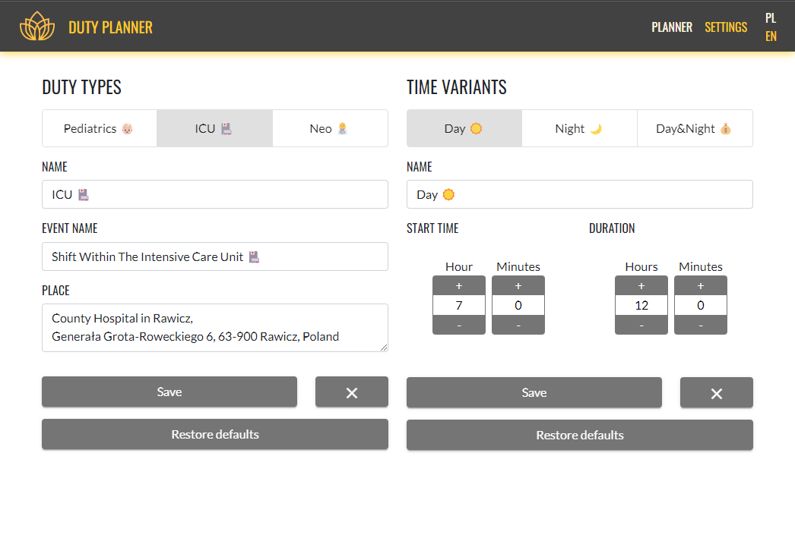
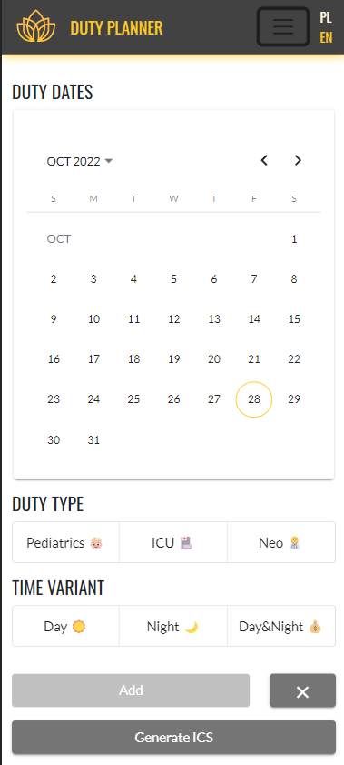
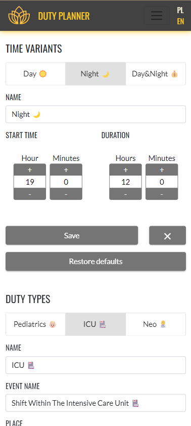

<!-- PROJECT LOGO -->
 

  

[//]: # (![Version][project-version-shield])

[![License][license-shield]][license-url]
![Top language][top-language-shield]
![Contributors][contributors-shield]
![Last commit][last-commit-shield]
![Angular version][angular-version-shield]
![Bootstrap version][bootstrap-version-shield]
[![LinkedIn][linkedin-shield]][linkedin-url]

<h3 align="center">Duty Planner</h3>

  ICS event creator, dedicated to people working in shifts. 
   
  Provides a faster and easier way to add your duty roster to calendars.
   
  <a href="https://github.com/InBinaryWorld/DutyPlanner"><strong>Explore the docs »</strong></a>
   
   
  <a href="https://duty-planner.herokuapp.com"><strong>View Demo</strong></a>
  ·
  <a href="https://github.com/InBinaryWorld/DutyPlanner/issues">Report Bug</a>
  ·
  <a href="https://github.com/InBinaryWorld/DutyPlanner/issues">Request Feature</a>

<!-- TABLE OF CONTENTS -->

## Table of Contents

* [About the Project](#about-the-project)
  * [How it started?](#how-it-started)
  * [Built With](#built-with)
* [Getting Started](#getting-started)
  * [Prerequisites](#prerequisites)
  * [Development server](#development-server)
  * [Build](#build)
  * [Express server](#express-server)
* [Roadmap](#roadmap)
* [License](#license)
* [Contact](#contact)

<!-- ABOUT THE PROJECT -->
## About The Project

The application has been designed to make it easier for shift workers to plan calendars and avoid adding events to the
calendar shift by shift. The application offers many features that reduce the time needed to provide a duty roster for
the next month to your calendar.

   

The application allows you to add shifts to the ICS calendar with a few clicks. The user can choose one of the defined 
types and time variants, then select multiple dates to add created combinations to the data store. Users can repeat the 
adding process many times before deciding to generate an ICS calendar.

   

On the setting page user is add new and modify existing types and time variants of duties without creating account.
All settings modifications are stored in browser memory using localstorage. Added plans also are persisted.

  
  &nbsp;&nbsp;&nbsp;&nbsp;&nbsp;&nbsp;&nbsp;&nbsp;&nbsp;&nbsp;&nbsp;&nbsp;&nbsp;&nbsp;&nbsp;&nbsp;&nbsp;&nbsp;&nbsp;&nbsp;
  

App is designed to responsively react on screen size changes. It supports PCs with wide screens and mobile devices like 
phones and everything between them. 

### How it started?

Draft:
My wife work in hospital and is shift-worker without standard work times. Every month and week is different and there
is no regularity. It's hard to manage your family time if not all its members know about your free time. On the way to
getting rid of this problem, we went through III stages:

#### Stage I.
Wife start to send duty roast photos to let me know about her availability.

Advantages:
* possibility to check when the shifts are.

Disadvantages:
* during the time going it's harder to find duty roast in photo jungle,
* it has a very unreadable form. It takes much time to find proper row and column on duty roaster.

#### Stage II.
We create a Google family calendar to share our plans. At beginning of month wife manually providing
every shift one by one.

Advantages:
* possibility to check when the shifts are,
* easy access,
* well readability.

Disadvantages:
* providing shifts is so boring and time-consuming.

#### Stage III.
We still use Google calendar to share our plans, but instead providing shifts manually, she uses Duty Planner.

Advantages:
* possibility to check when the shifts are,
* easy access,
* well readability,
* easy and quick add shifts to the calendar.

Disadvantages:
* None

All that is to make my family life better :) \
Ultimately, it's good enough that we're not the only ones who use it :)

### Built With

Project is created with TypeScript using Angular 13, HTML5 and SCSS. Project also take advantages of:

* [ICS v2.35](https://github.com/adamgibbons/ics)
* [RxJs v7.5](https://rxjs.dev)
* [NgRx v13.2](https://github.com/ngrx/platform#readme)
* [Lodash v4.17](https://lodash.com/)
* [Bootstrap v5.1](https://getbootstrap.com/docs/5.1/getting-started/introduction)
* [Ngx-translate v14](https://github.com/ngx-translate/core)
* [NgRx-Store-LocalStorage v13.0](https://github.com/btroncone/ngrx-store-localstorage#readme)

<!-- GETTING STARTED -->

## Getting Started

### Prerequisites

To Start this app, you first need to get:

* [Node][python-download-url] in version 12.20.x/14.15.x/16.10.x or later minor version.

### Development server

Run `ng serve` for a dev server. Navigate to `http://localhost:4200/`. The application will automatically reload if you
change any of the source files.

### Build

Run `ng build` to build the project. The build artifacts will be stored in the `dist/` directory.

### Express server

Run `npm start` to start Express server to serve static app files (Build is required). 
This command uses created server.js script which allows Heroku to deploy app. 

<!-- ROADMAP -->
## Roadmap

See the [issues panel][project-issue-url] for a list of proposed features.

Waiting for better times:

* OCR support - It would be perfect to use AWS OCR solution to automatically convert duty roster to ICS calendar.

* Duty Scheduler - New functionality for persons who create duty roaster. It will use a complex algorithms to generate
  duty roaster taking into account the initial (not simply) conditions.

* UI/UX support for fold devices - Currently app needs to be improved to handle extremely narrow screens like in fold phones.

<!-- LICENSE -->
## License

Distributed under the [MIT License][license-url]. See `LICENSE` for more information.

<!-- CONTACT -->
## Contact

Find me on:

[![LinkedIn][linkedin-shield]][linkedin-url]
[![Github][github-user-shield]][github-user-url]

<!-- MARKDOWN LINKS & IMAGES -->

[license-shield]: https://img.shields.io/github/license/InBinaryWorld/DutyPlanner

[license-url]: https://github.com/InBinaryWorld/DutyPlanner/blob/master/LICENSE

[top-language-shield]: https://img.shields.io/github/languages/top/InBinaryWorld/DutyPlanner

[project-version-shield]: https://img.shields.io/github/package-json/v/InBinaryWorld/DutyPlanner

[contributors-shield]: https://img.shields.io/github/contributors/InBinaryWorld/DutyPlanner

[contributors-url]: https://github.com/InBinaryWord/DutyPlanner/graphs/contributors

[last-commit-shield]:https://img.shields.io/github/last-commit/InBinaryWorld/DutyPlanner

[bootstrap-version-shield]: https://img.shields.io/github/package-json/dependency-version/InBinaryWorld/DutyPlanner/bootstrap

[angular-version-shield]: https://img.shields.io/github/package-json/dependency-version/InBinaryWorld/DutyPlanner/@angular/core

[linkedin-shield]: https://img.shields.io/badge/-LinkedIn-black.svg?style=flat-square&logo=linkedin&color=175a7a

[linkedin-url]: https://linkedin.com/in/Krzysztof-Szafraniak

[github-user-shield]: https://img.shields.io/badge/-GitHub-black.svg?style=flat-square&logo=github&color=171515

[github-user-url]: https://github.com/InBinaryWorld

[python-download-url]: https://www.python.org/downloads

[project-url]: https://github.com/InBinaryWorld/DutyPlanner

[project-issue-url]: https://github.com/InBinaryWorld/DutyPlanner/issues

[img-ss]: images/ss1.png
